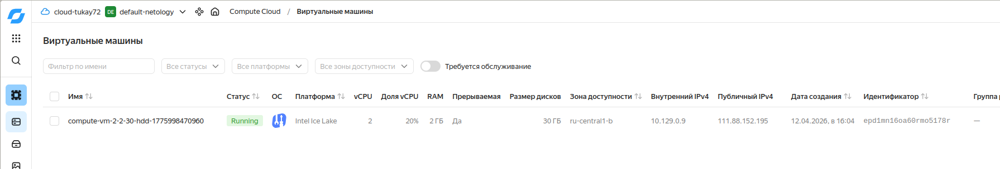
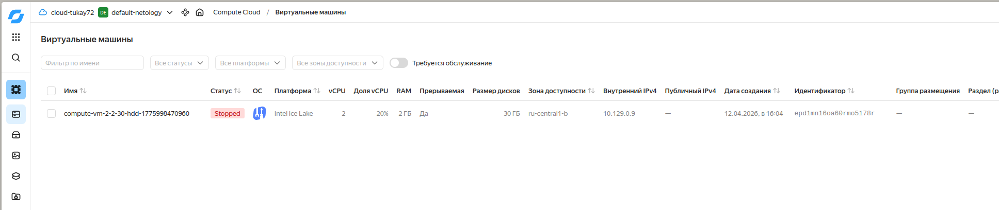
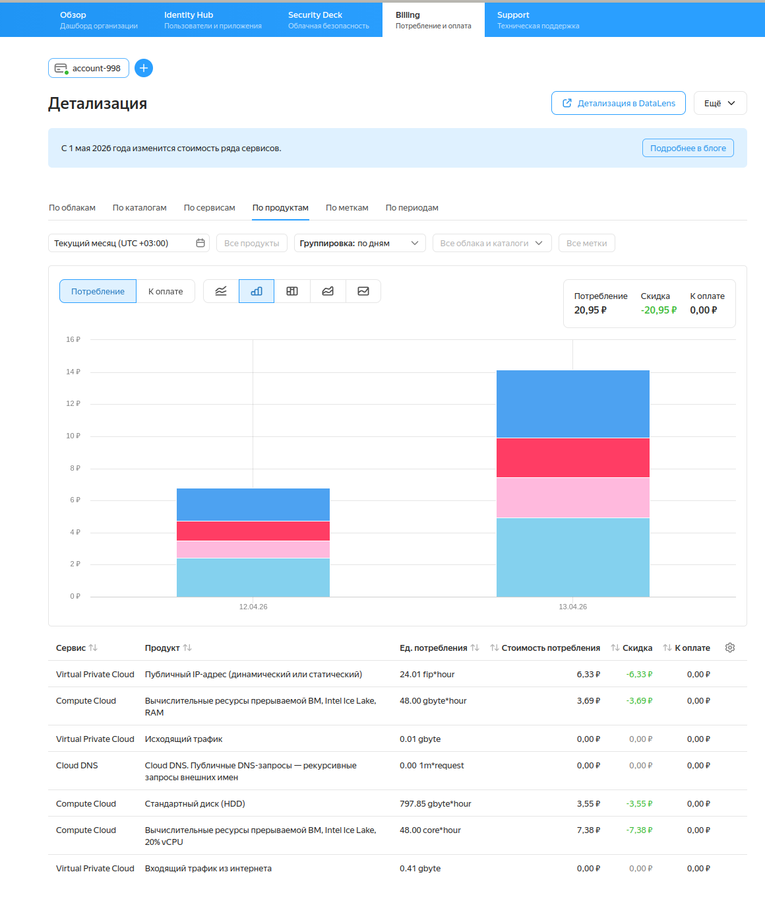

# Домашнее задание к занятию 1.  «Введение в виртуализацию» Тукаев Айрат

#### Это задание для самостоятельной отработки навыков и не предполагает обратной связи от преподавателя. Его выполнение не влияет на завершение модуля. Но мы рекомендуем его выполнить, чтобы закрепить полученные знания.  Все вопросы, возникающие в процессе выполнения заданий, пишите в раздел "Вопросы по заданиям" в личном кабинете.

### Цели задания
1. Научиться запускать виртуальную машину в Yandex Cloud с минимальным расходом ресурсов.
2. Попрактиковаться в выборе платформы  и системы управления виртуализации для решения требуемых задач.

### Инструкция к выполению

1. Для выполнения задачи 1 ознакомьтесь с [инструкцией](https://github.com/netology-code/devops-materials/blob/master/cloudwork.MD) по экономии облачных ресурсов и затем выполните задачу 1 по шагам.
2. Своё решение к задачам 2,3,4 загрузите  в ваш ЛК.
   
## Задача 1

Ознакомьтесь с [инструкцией ](https://github.com/netology-code/devops-materials/blob/master/cloudwork.MD) по экономии облачных ресурсов.


1. Создайте через web-интерфейс Yandex Cloud - VPC и виртуальную машину из инструкции конфигурации "эконом-ВМ" с публичным ip-адресом. В пункте "Выбор образа/загрузочного диска" выберите вкладку "Cloud Marketplace" , щелкните "Посмотреть больше", найдите образ "Yandex Cloud Toolbox".
2. Убедитесь, что вы можете подключиться к консоли ВМ через ssh, используя публичный ip-адрес. Убедитесь, что на ВМ установлен Docker с помощью команды ```docker --version```(команду выполните от имени root пользователя) !
3. Узнайте в инструкции Яндекс, какие еще инструменты предустановлены в данном образе.
4. Оставьте ВМ работать, пока она не выключится самостоятельно! Опция "прерываемая" выключит ее не позже чем через 24 часа. 
5. Для наглядности подождите еще 1 сутки.
6. Перейдите по [ссылке ](https://console.cloud.yandex.ru/billing?section=accounts). Выберите свой платежный аккаунт. Перейдите на вкладку детализация (фильтр "По продуктам") и оцените график потребления финансов.
7. Удалите ВМ или пользуйтесь ею при выполнении последующих домашних заданий курса обучения.

**Выполнение:**  
1. В Yandex Cloud создал виртуальную машину с с публичным ip-адресом. Использовал образ "Yandex Cloud Toolbox". Для данного образа минимальный размер диска составляет 30 ГБ.  
    

2. Подключился к консоли ВМ через ssh, используя публичный ip-адрес. Убедился, что на ВМ установлен Docker с помощью команды ```sudo docker --version```.  
    

3. В данном образе предустановлены следующие инструменты:  
 * интерфейс командной строки Yandex Cloud;  
 * Terraform — инструмент для управления облачной инфраструктурой от компании Hashicorp;  
 * Packer — инструмент для сборки образов виртуальных машин от компании Hashicorp;  
 * Pulumi — инструмент для управления облачной инфраструктурой с использованием традиционных языков программирования;  
 * Helm — менеджер пакетов для Kubernetes;  
 * kubectl — инструмент командной строки для управления кластерами Kubernetes;  
 * gRPCurl — инструмент командной строки для взаимодействия с серверами gRPC;  
 * jq — JSON-процессор командной строки;  
 * yq — YAML-, JSON- и XML-процессор командной строки;  
 * Docker — платформа для разработки контейнерных приложений;  
 * Git — система контроля версий;  
 * tree — утилита для просмотра дерева директорий;  
 * tmux — терминальный мультиплексор.  

4. Оставил работать виртуальную машину до следующего дня. На следующий день проверил, машина выключена. 
    

5. Перешёл по [ссылке ](https://console.cloud.yandex.ru/billing?section=accounts). Суточный расход составил 20 рублей 95 копеек.  
    

---


## Задача 2

Выберите один из вариантов платформы в зависимости от задачи. Здесь нет однозначно верного ответа так как все зависит от конкретных условий: финансирование, компетенции специалистов, удобство использования, надежность, требования ИБ и законодательства, фазы луны.

Тип платформы:

- физические сервера;
- паравиртуализация;
- виртуализация уровня ОС;

Задачи:

- высоконагруженная база данных MySql, критичная к отказу;
- различные web-приложения;
- Windows-системы для использования бухгалтерским отделом;
- системы, выполняющие высокопроизводительные расчёты на GPU.

Объясните критерии выбора платформы в каждом случае.

**Выполнение:**  
- высоконагруженная база данных MySQL, критичная к отказу:  
  Оптимальный выбор — физические серверы. Прямой доступ к оборудованию обеспечивает максимальную производительность I/O-операций и минимизирует задержки, вызванные виртуализацией. Возможность использования RAID-массивов и специализированных SSD-накопителей для достижения высокой скорости обработки запросов. Гибкость и контроль над аппаратурой позволяют точно настраивать оборудование под нужды конкретной нагрузки. Резервные решения на физическом уровне (резервные диски, дублирование питания и охлаждения) повышают отказоустойчивость.  
- различные web-приложения:  
  Оптимальный выбор — виртуализация уровня ОС (контейнеризация). Контейнеры (Docker, LXC) обеспечивают высокую плотность размещения приложений, простоту масштабирования и миграции. Это позволяет оперативно разворачивать и поддерживать большое количество веб-сервисов. Изоляция окружения для разных приложений повышает безопасность и снижает риски взаимного влияния.  
- Windows-системы для использования бухгалтерским отделом;  
  Оптимальный выбор — паравиртуализация (например, Hyper-V, VMware). Гипервизоры позволяют создавать полноценные виртуальные машины с полной эмуляцией аппаратуры, обеспечивая совместимость с Windows-системами. Поддерживаются драйверы графического интерфейса и устройств, что улучшает взаимодействие пользователей с рабочими средами. Также паравиртуализация упрощает централизованное управление и поддержку множества рабочих станций из единого центра.  
- системы, выполняющие высокопроизводительные расчёты на GPU:  
  Оптимальный выбор — физические серверы. Гарантированное прямое обращение к физическим ресурсам GPU обеспечивает наилучшую производительность. Отсутствие накладных расходов виртуализации ускоряет процессы вычислений. Физический доступ к высокоскоростной сети и мощным устройствам хранения данных гарантирует минимальные задержки и высокие показатели эффективности.  

## Задача 3

Выберите подходящую систему управления виртуализацией для предложенного сценария. Опишите ваш выбор.

Сценарии:

1. 100 виртуальных машин на базе Linux и Windows, общие задачи, нет особых требований. Преимущественно Windows based-инфраструктура, требуется реализация программных балансировщиков нагрузки, репликации данных и автоматизированного механизма создания резервных копий.
2. Требуется наиболее производительное бесплатное open source-решение для виртуализации небольшой (20-30 серверов) инфраструктуры на базе Linux и Windows виртуальных машин.
3. Необходимо бесплатное, максимально совместимое и производительное решение для виртуализации Windows-инфраструктуры.
4. Необходимо рабочее окружение для тестирования программного продукта на нескольких дистрибутивах Linux.

**Выполнение:**    
1. Необходима аппаратная виртуализация (создание VM с различными ОС). Подойдет Xen с открытым исходным кодом, поддержка Windows, Linux ОС, с возможностью функции миграции.  
2. Необходима аппаратная виртуализация (создание VM с различными ОС). Подойдет Xen с открытым исходным кодом, поддержка Windows, Linux ОС, с возможностью функции миграции.  
3. Hyper-V Server "заточен" для продуктов Microsoft и безплатный.  
4. Выбор среди вариантов для ядер Linux - KVM. Преимущество к производительности. Поддержка большинства Linux платформ.  


## Задача 4

Опишите возможные проблемы и недостатки гетерогенной среды виртуализации (использования нескольких систем управления виртуализацией одновременно) и что необходимо сделать для минимизации этих рисков и проблем. Если бы у вас был выбор, создавали бы вы гетерогенную среду или нет?

**Выполнение:**  
Возможные проблемы и недостатки гетерогенной среды виртуализации:  
 * Сложность в управлении;  
 * Неэффективность использование ресурсов;  
 * Необходим большой штат сотрудников для поддержки;  
 * Сложность переноса данных между разными средами.  

 Для минимизации этих раисков необходимо использовать комплексные решения, которые смогут функционировать как в физической, так и в виртуальной среде. Нужно максимально снизить вероятность несовместимости технологий и упростить управление инфраструктурой. Необходима универсальная платформа.


### Правила приема

Домашнее задание выполните в файле readme.md в GitHub-репозитории. В личном кабинете отправьте на проверку ссылку на .md-файл в вашем репозитории.

