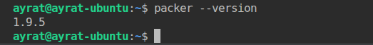
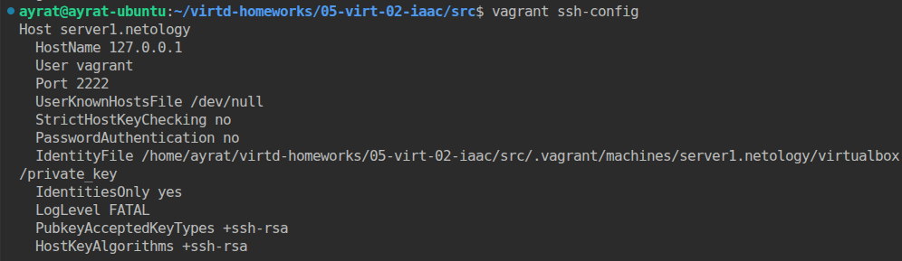
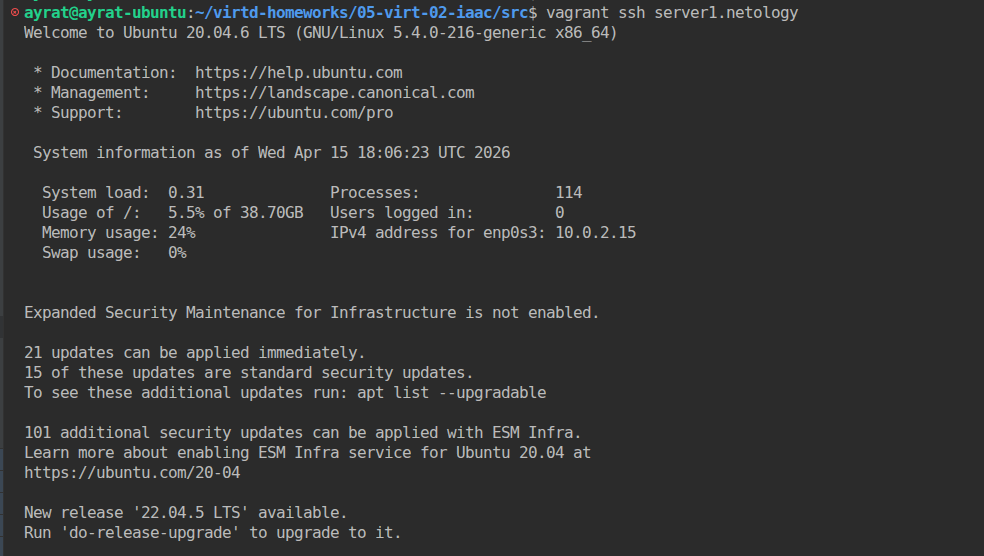
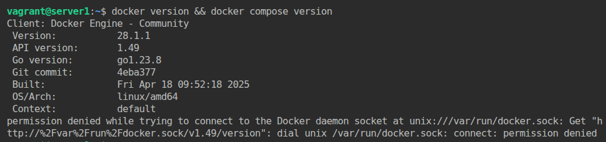
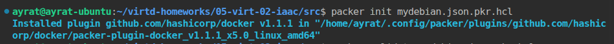
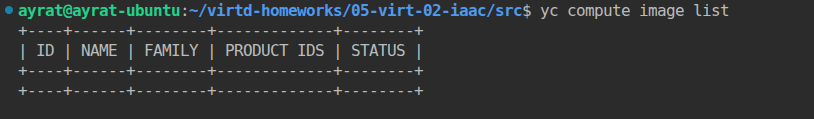
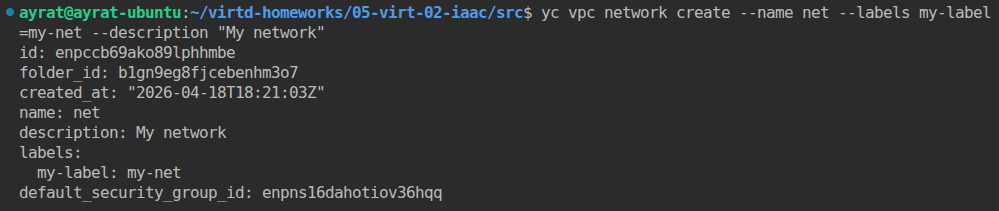
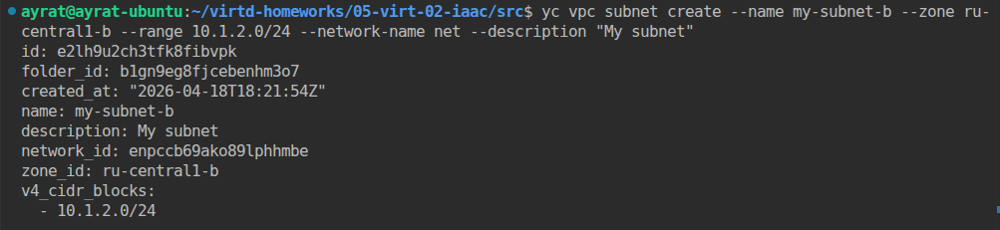
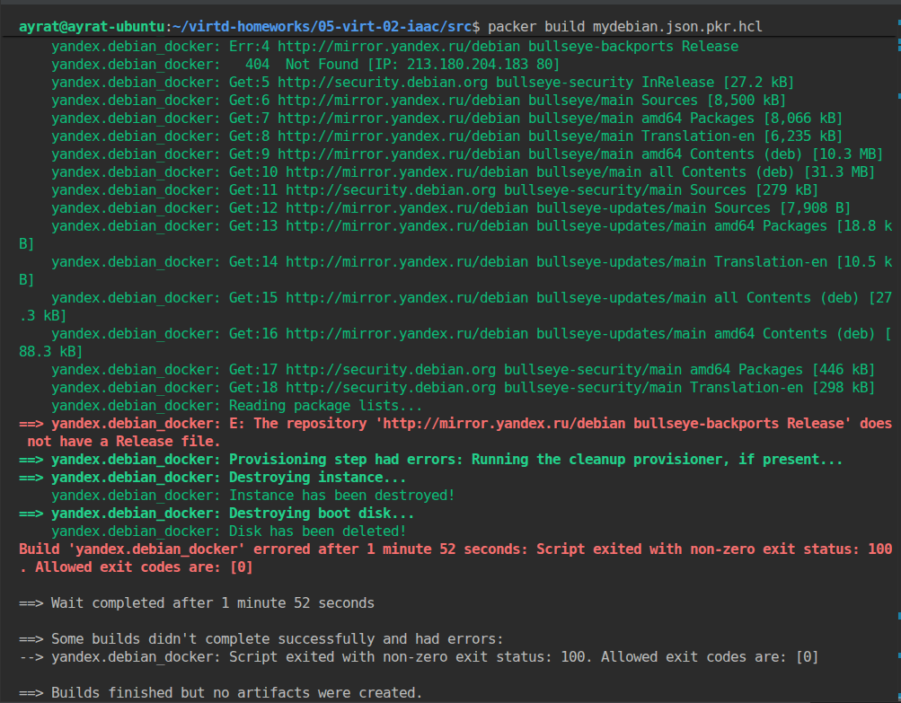

# Домашнее задание к занятию 2. «Применение принципов IaaC в работе с виртуальными машинами»  Тукаев Айрат

#### Это задание для самостоятельной отработки навыков и не предполагает обратной связи от преподавателя. Его выполнение не влияет на завершение модуля. Но мы рекомендуем его выполнить, чтобы закрепить полученные знания. Все вопросы, возникающие в процессе выполнения заданий, пишите в раздел "Вопросы по заданиям" в личном кабинете.
---
## Важно

**Перед началом работы над заданием изучите [Инструкцию по экономии облачных ресурсов](https://github.com/netology-code/devops-materials/blob/master/cloudwork.MD).**
Перед отправкой работы на проверку удаляйте неиспользуемые ресурсы.
Это нужно, чтобы не расходовать средства, полученные в результате использования промокода.
Подробные рекомендации [здесь](https://github.com/netology-code/virt-homeworks/blob/virt-11/r/README.md).

---

### Цели задания

1. Научиться создвать виртуальные машины в Virtualbox с помощью Vagrant.
2. Научиться базовому использованию packer в yandex cloud.

   
## Задача 1
Установите на личный Linux-компьютер или учебную **локальную** ВМ с Linux следующие сервисы(желательно ОС ubuntu 20.04):

- [VirtualBox](https://www.virtualbox.org/),
- [Vagrant](https://github.com/netology-code/devops-materials), рекомендуем версию 2.3.4
- [Packer](https://github.com/netology-code/devops-materials/blob/master/README.md) версии 1.9.х + плагин от Яндекс Облако по [инструкции](https://cloud.yandex.ru/docs/tutorials/infrastructure-management/packer-quickstart)
- [уandex cloud cli](https://cloud.yandex.com/ru/docs/cli/quickstart) Так же инициализируйте профиль с помощью ```yc init``` .

**Выполнение:**  
 * имеется ноутбук с Ubuntu 25.04, где установлен VirtualBox 7.0.20. Также установлен Vagrant 2.4.9.  
 * устанавливаю Packer 1.9.5. :   
```
mkdir packer
wget https://hashicorp-releases.yandexcloud.net/packer/1.9.5/packer_1.9.5_linux_amd64.zip -P ~/packer
unzip ~/packer/packer_1.9.5_linux_amd64.zip -d ~/packer
export PATH="$PATH:/home/ayrat/packer"
exec -l $SHELL
```
   Убеждаюсь что Packer установлен.  
      
 * устанавливаю уandex cloud cli:  
```
curl -sSL https://storage.yandexcloud.net/yandexcloud-yc/install.sh | bash
```
 * инициализирую профиль:  
 ```
yc init --username=tukay72@yandex.ru
 ```


Примечание: Облачная ВМ с Linux в данной задаче не подойдёт из-за ограничений облачного провайдера. У вас просто не установится virtualbox.

## Задача 2

1. Убедитесь, что у вас есть ssh ключ в ОС или создайте его с помощью команды ```ssh-keygen -t ed25519```
2. Создайте виртуальную машину Virtualbox с помощью Vagrant и  [Vagrantfile](https://github.com/netology-code/virtd-homeworks/blob/shvirtd-1/05-virt-02-iaac/src/Vagrantfile) в директории src.
3. Зайдите внутрь ВМ и убедитесь, что Docker установлен с помощью команды:
```
docker version && docker compose version
```
**Выполнение:**  
 Создал виртуальную машину с помощью Vagrant:  
 ```
vagrant up
 ```
 Проверил результат с помощью команды:  
 ```
 vagrant ssh-config
 ```
    

 Подключился к виртуальной машине и убедился что Docker установлен.  
```
vagrant ssh server1.netology
docker version && docker compose version
```
    
    

3. Если Vagrant выдаёт ошибку (блокировка трафика):
```
URL: ["https://vagrantcloud.com/bento/ubuntu-20.04"]     
Error: The requested URL returned error: 404:
```

Выполните следующие действия:

- Используйте [зеркало](https://vagrant.elab.pro/downloads/) файл-образ "bento/ubuntu-24.04".

**Важно:**    
- Если ваша хостовая рабочая станция - это windows ОС, то у вас могут возникнуть проблемы со вложенной виртуализацией. Ознакомиться со cпособами решения можно [по ссылке](https://www.comss.ru/page.php?id=7726).

- Если вы устанавливали hyper-v или docker desktop, то  все равно может возникать ошибка:  
`Stderr: VBoxManage: error: AMD-V VT-X is not available (VERR_SVM_NO_SVM)`   
 Попробуйте в этом случае выполнить в Windows от администратора команду `bcdedit /set hypervisorlaunchtype off` и перезагрузиться.

- Если ваша рабочая станция в меру различных факторов не может запустить вложенную виртуализацию - допускается неполное выполнение(до ошибки запуска ВМ)

## Задача 3

1. Отредактируйте файл    [mydebian.json.pkr.hcl](https://github.com/netology-code/virtd-homeworks/blob/shvirtd-1/05-virt-02-iaac/src/mydebian.json.pkr.hcl)  или [mydebian.jsonl](https://github.com/netology-code/virtd-homeworks/blob/shvirtd-1/05-virt-02-iaac/src/mydebian.json) в директории src (packer умеет и в json, и в hcl форматы):
   - добавьте в скрипт установку docker. Возьмите скрипт установки для debian из  [документации](https://docs.docker.com/engine/install/debian/)  к docker, 
   - дополнительно установите в данном образе htop и tmux.(не забудьте про ключ автоматического подтверждения установки для apt)
3. Найдите свой образ в web консоли yandex_cloud
4. Необязательное задание(*): найдите в документации yandex cloud как найти свой образ с помощью утилиты командной строки "yc cli".
5. Создайте новую ВМ (минимальные параметры) в облаке, используя данный образ.
6. Подключитесь по ssh и убедитесь в наличии установленного docker.
7. Удалите ВМ и образ.
8. **ВНИМАНИЕ!** Никогда не выкладываете oauth token от облака в git-репозиторий! Утечка секретного токена может привести к финансовым потерям. После выполнения задания обязательно удалите секретные данные из файла mydebian.json и mydebian.json.pkr.hcl. (замените содержимое токена на  "ххххх")
9. В качестве ответа на задание  загрузите результирующий файл в ваш ЛК.

**Выполнение:** 
  Инициализировал packer:  
```
packer init mydebian.json.pkr.hcl
```
   

 Проверил наличие имиджей в яндекс облаке:  
 ```
yc compute image list
 ```
     
 
 Создал сеть:  
```
yc vpc network create --name net --labels my-label=my-net --description "My network"
```
   

 Создал подсеть:  
```
yc vpc subnet create --name my-subnet-b --zone ru-central1-b --range 10.1.2.0/24 --network-name net --description "My subnet"
```
   

 Отредактировал файл  , добавил скрипт установки докера, htop и tmux.
```
packer {
  required_plugins {
    docker = {
      version = ">= 1.0.8"
      source = "github.com/hashicorp/docker"
    }
  }
}

source "yandex" "debian_docker" {
  disk_type           = "network-hdd"
  folder_id           = "b1............."
  image_description   = "my custom debian with docker"
  image_name          = "debian-11-docker"
  source_image_family = "debian-11"
  ssh_username        = "debian"
  subnet_id           = "e2lh9u2ch3tfk8fibvpk"
  token               = "y0__x..................."
  use_ipv4_nat        = true
  zone                = "ru-central1-b"
}


build {
  sources = ["source.yandex.debian_docker"]

 provisioner "shell" {
    inline = [
      "sudo apt update",
      "sudo apt install ca-certificates curl",
      "sudo install -m 0755 -d /etc/apt/keyrings",
      "sudo curl -fsSL https://download.docker.com/linux/debian/gpg -o /etc/apt/keyrings/docker.asc",
      "sudo chmod a+r /etc/apt/keyrings/docker.asc",
      "sudo tee /etc/apt/sources.list.d/docker.sources",
      "sudo apt update",
      "sudo apt install -y docker-ce docker-ce-cli containerd.io docker-buildx-plugin docker-compose-plugin",
      "sudo apt install -y htop",
      "sudo apt install -y tmux"
    ]
  }
}
```
 Проверил файл на валидность:
```
packer validate mydebian.json.pkr.hcl
```
   

 Запустил сборку образа:  
```
packer build mydebian.json.pkr.hcl
```
 Запуск закончился ошибкой.
   