# Домашнее задание к занятию 4 «Оркестрация группой Docker контейнеров на примере Docker Compose» Тукаев Айрат

## Задача 1

Сценарий выполнения задачи:
- Установите docker и docker compose plugin на свою linux рабочую станцию или ВМ.
- Если dockerhub недоступен создайте файл /etc/docker/daemon.json с содержимым: ```{"registry-mirrors": ["https://mirror.gcr.io", "https://daocloud.io", "https://c.163.com/", "https://registry.docker-cn.com"]}```
- Зарегистрируйтесь и создайте публичный репозиторий  с именем "custom-nginx" на https://hub.docker.com (ТОЛЬКО ЕСЛИ У ВАС ЕСТЬ ДОСТУП);
- скачайте образ nginx:1.29.0;
- Создайте Dockerfile и реализуйте в нем замену дефолтной индекс-страницы(/usr/share/nginx/html/index.html), на файл index.html с содержимым:
```
<html>
<head>
Hey, Netology
</head>
<body>
<h1>I will be DevOps Engineer!</h1>
</body>
</html>
```
- Соберите и отправьте созданный образ в свой dockerhub-репозитории c tag 1.0.0 (ТОЛЬКО ЕСЛИ ЕСТЬ ДОСТУП). 
- Предоставьте ответ в виде ссылки на https://hub.docker.com/<username_repo>/custom-nginx/general .

**Выполнение:**  

- Установил docker и docker compose plugin на виртуальную машину на Yandex Cloud с ОС Ubuntu 24.04. Командой ```docker version``` убедился что в системе отсутствует docker.  
 Запустил команду установки вспомогательных утилит. Они уже установлены.
```
sudo apt install git curl
```
  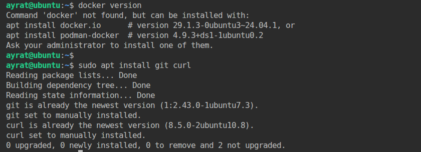  

```
# Add Docker's official GPG key:
sudo apt update
sudo apt install ca-certificates curl
sudo install -m 0755 -d /etc/apt/keyrings
sudo curl -fsSL https://download.docker.com/linux/ubuntu/gpg -o /etc/apt/keyrings/docker.asc
sudo chmod a+r /etc/apt/keyrings/docker.asc

# Add the repository to Apt sources:
sudo tee /etc/apt/sources.list.d/docker.sources <<EOF
Types: deb
URIs: https://download.docker.com/linux/ubuntu
Suites: $(. /etc/os-release && echo "${UBUNTU_CODENAME:-$VERSION_CODENAME}")
Components: stable
Architectures: $(dpkg --print-architecture)
Signed-By: /etc/apt/keyrings/docker.asc
EOF

sudo apt update

sudo apt install docker-ce docker-ce-cli containerd.io docker-buildx-plugin docker-compose-plugin
```
Убедился что докер работает:
```
sudo systemctl status docker
```
  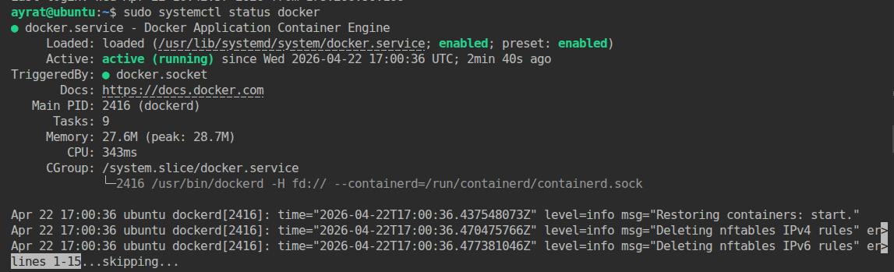  

- У меня dockerhub доступен поэтому файл /etc/docker/daemon.json не создавал.  

- Создал публичный репозиторий  с именем "custom-nginx" на https://hub.docker.com.  
  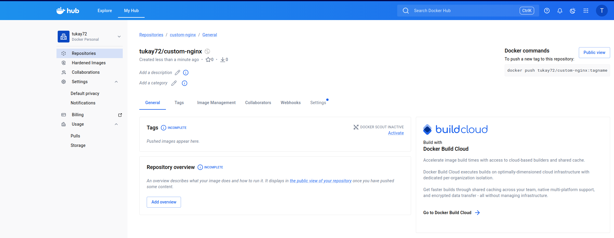  

- Cкачал образ nginx:1.29.0.
```
docker pull nginx:1.29
docker images
```
  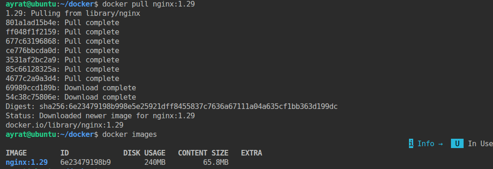  

  Создал контейнер и проверил его работу:
```
docker run -d -p 8090:80 --name yy nginx:1.29
docker ps
```
  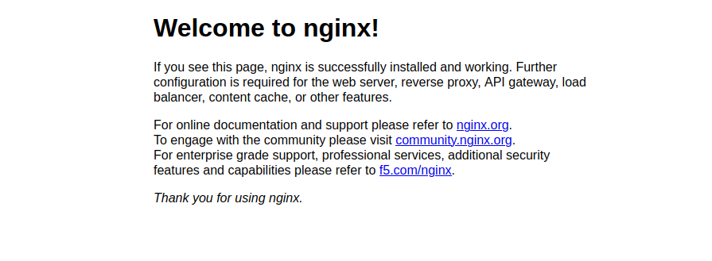  
  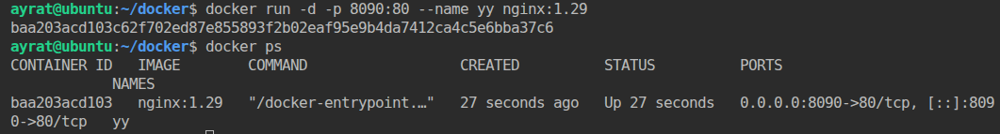    

- Создал Dockerfile и реализовал в нем замену дефолтной индекс-страницы(/usr/share/nginx/html/index.html), на файл index.html с содержимым:
```
<html>
<head>
Hey, Netology
</head>
<body>
<h1>I will be DevOps Engineer!</h1>
</body>
</html>
```
  Содержание Dockerfile:  
```
FROM nginx:1.29.0
COPY ./index.html /usr/share/nginx/html/index.html
```
  Создал образ. Запустил контейнер и проверил его работу:  
  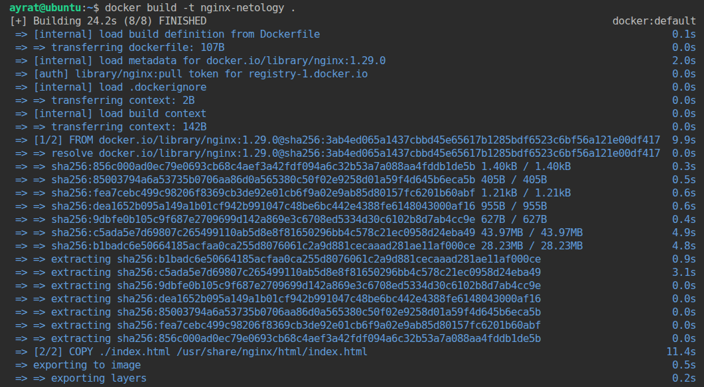   
  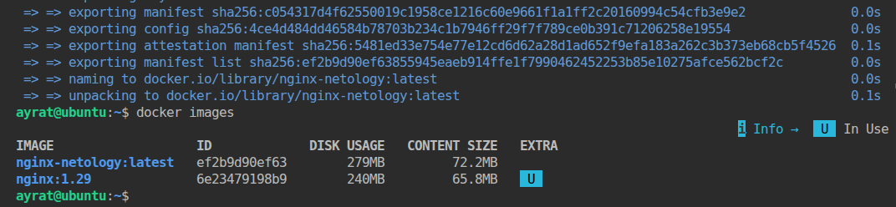   
  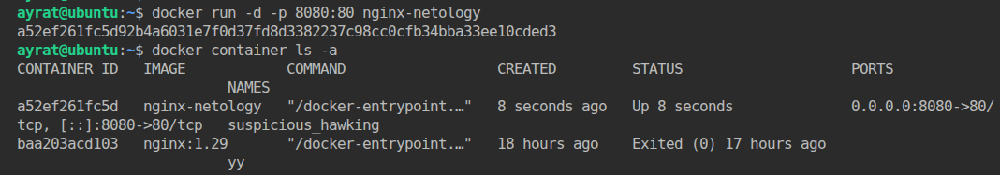   
  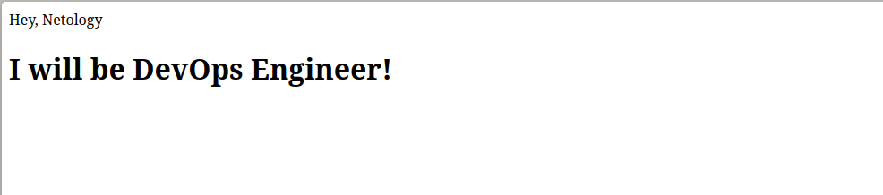   

- Подготовил и отправил созданный образ в свой dockerhub-репозитории c tag 1.0.0.  
```
docker images                                          # проверил имеющиеся образы
docker tag nginx-netology tukay72/custom-nginx:1.0.0   # переименовал файл для отправки, добавил тег
docker push tukay72/custom-nginx:1.0.0                 # отправил в dockerhub-репозитории
```
  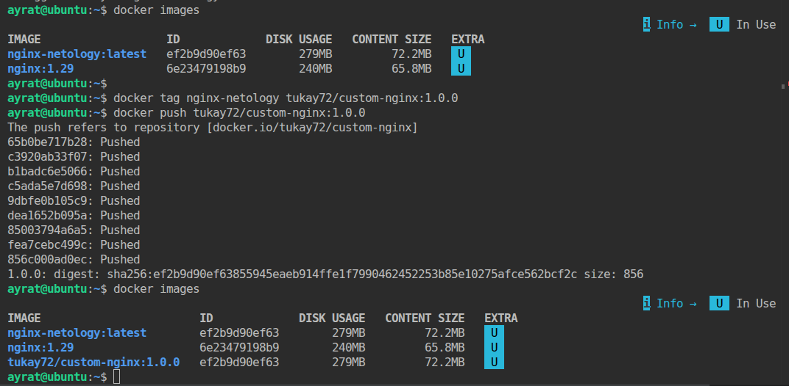  

- Cсылка на репозиторий https://hub.docker.com/repository/docker/tukay72/custom-nginx/general.  

## Задача 2
1. Запустите ваш образ custom-nginx:1.0.0 командой docker run в соответвии с требованиями:
- имя контейнера "ФИО-custom-nginx-t2"
- контейнер работает в фоне
- контейнер опубликован на порту хост системы 127.0.0.1:8080
2. Не удаляя, переименуйте контейнер в "custom-nginx-t2"
3. Выполните команду ```date +"%d-%m-%Y %T.%N %Z" ; sleep 0.150 ; docker ps ; ss -tlpn | grep 127.0.0.1:8080  ; docker logs custom-nginx-t2 -n1 ; docker exec -it custom-nginx-t2 base64 /usr/share/nginx/html/index.html```
4. Убедитесь с помощью curl или веб браузера, что индекс-страница доступна.

В качестве ответа приложите скриншоты консоли, где видно все введенные команды и их вывод.

**Выполнение:**  
 Использованные команды:   
```
docker container ls -a
docker run -d -p 8080:80 --name TukaevAR-custom-nginx-t2 tukay72/custom-nginx:1.0.0
docker rename TukaevAR-custom-nginx-t2 custom-nginx-t2
date +"%d-%m-%Y %T.%N %Z" ;             # выводит теущую дату и время
sleep 0.150 ;                           # приостанавливает выполнение следующего этапа выполнения программы на 0,15 секунды
docker ps ;                             # выводит список работающих контейнеров                                 
ss -tlpn | grep 127.0.0.1:8080  ;       # проверяет, какие сокеты (процессы) слушают порт 8080 на локальном хосте
docker logs custom-nginx-t2 -n1 ;       # просмотр последнего лога контейнера custom-nginx-t2
docker exec -it custom-nginx-t2 base64 /usr/share/nginx/html/index.html  # подключение к контейнеру в выполнение команды base64 /usr/share/nginx/html/index.html
curl http://127.0.0.1:8080
```
  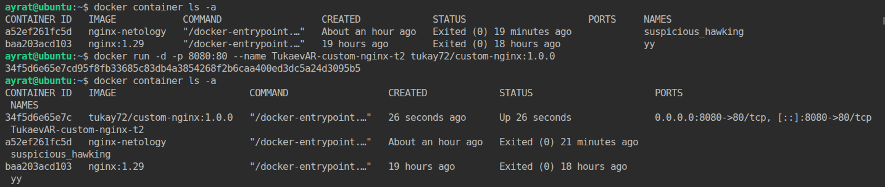
  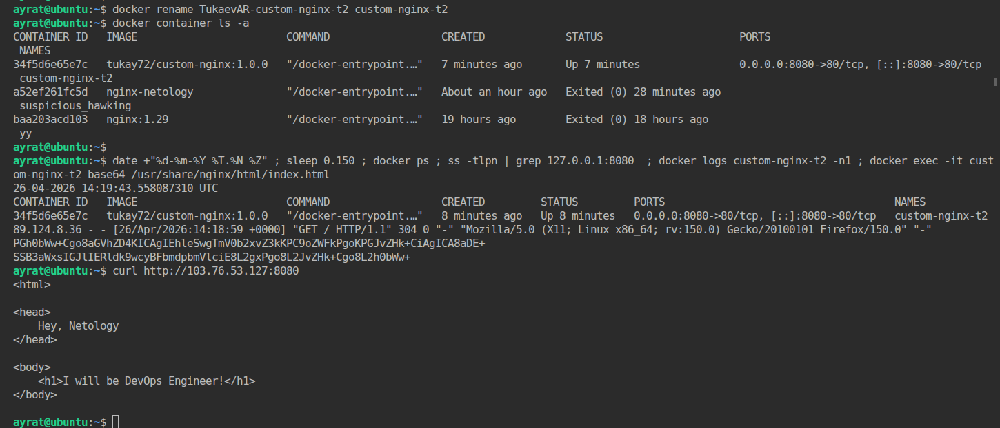 
  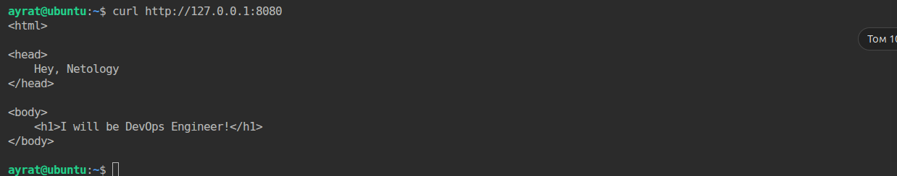    
 

## Задача 3
1. Воспользуйтесь docker help или google, чтобы узнать как подключиться к стандартному потоку ввода/вывода/ошибок контейнера "custom-nginx-t2".
2. Подключитесь к контейнеру и нажмите комбинацию Ctrl-C.
3. Выполните ```docker ps -a``` и объясните своими словами почему контейнер остановился.
4. Перезапустите контейнер
5. Зайдите в интерактивный терминал контейнера "custom-nginx-t2" с оболочкой bash.
6. Установите любимый текстовый редактор(vim, nano итд) с помощью apt-get.
7. Отредактируйте файл "/etc/nginx/conf.d/default.conf", заменив порт "listen 80" на "listen 81".
8. Запомните(!) и выполните команду ```nginx -s reload```, а затем внутри контейнера ```curl http://127.0.0.1:80 ; curl http://127.0.0.1:81```.
9. Выйдите из контейнера, набрав в консоли  ```exit``` или Ctrl-D.
10. Проверьте вывод команд: ```ss -tlpn | grep 127.0.0.1:8080``` , ```docker port custom-nginx-t2```, ```curl http://127.0.0.1:8080```. Кратко объясните суть возникшей проблемы.
11. * Это дополнительное, необязательное задание. Попробуйте самостоятельно исправить конфигурацию контейнера, используя доступные источники в интернете. Не изменяйте конфигурацию nginx и не удаляйте контейнер. Останавливать контейнер можно. [пример источника](https://www.baeldung.com/linux/assign-port-docker-container)
12. Удалите запущенный контейнер "custom-nginx-t2", не останавливая его.(воспользуйтесь --help или google)

В качестве ответа приложите скриншоты консоли, где видно все введенные команды и их вывод.

**Выполнение:**  
1. Командой ```docker attach custom-nginx-t2```подключился к стандартному потоку ввода/вывода/ошибок контейнера "custom-nginx-t2".
2. После нажатия комбинацию клавиш Ctrl-C отключился от стандартного потока.  
  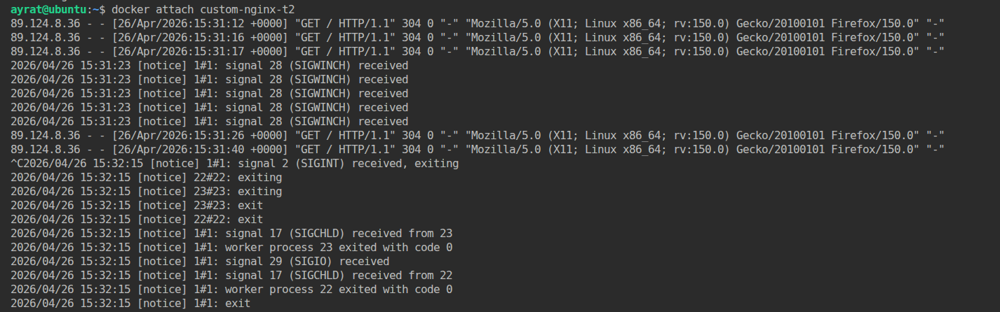  

3. Выполнил команду ```docker ps -a```. Контейнер custom-nginx-t2 остановлен. Нажатие клавиш Ctrl-C завершает основной процесс контейнера. Поскольку контейнер зависит от работы основного процесса, его остановка происхдит автоматический.
  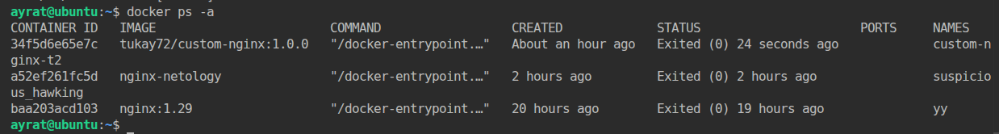  

4. Перезапустил контейнер командой ```docker start custom-nginx-t2```
5. Зашёл в интерактивный терминал контейнера "custom-nginx-t2" с оболочкой bash ```docker exec -it custom-nginx-t2 bash```.
6. Установил текстовый редактор nano.
```
apt update
apt install nano
```
  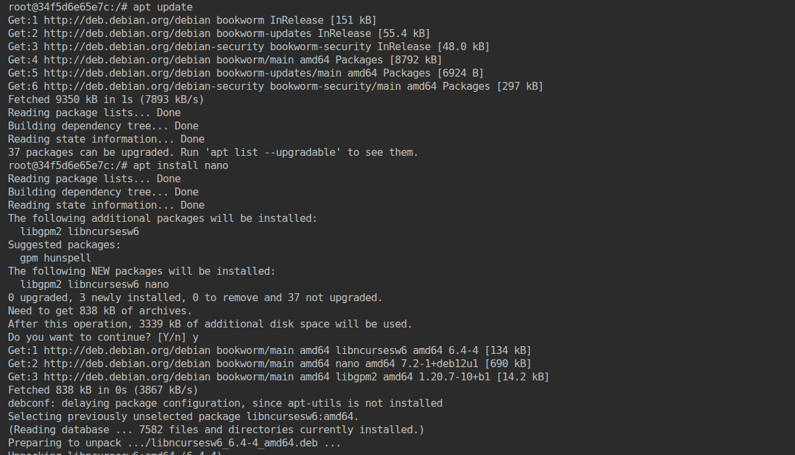  

7. Отредактировал файл "/etc/nginx/conf.d/default.conf", заменив порт "listen 80" на "listen 81".
  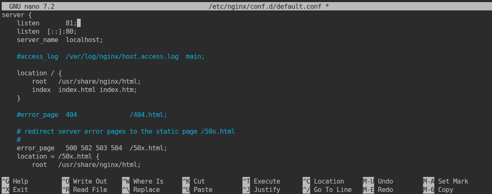  

8. Выполнил команду ```nginx -s reload```, а затем внутри контейнера ```curl http://127.0.0.1:80 ; curl http://127.0.0.1:81```.
  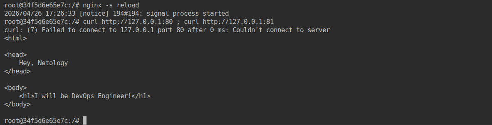  

9. Вышел из контейнера, набрав в консоли  ```exit```.
  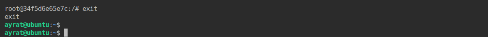  

10. Проверил вывод команд: ```ss -tlpn | grep 127.0.0.1:8080``` , ```docker port custom-nginx-t2```, ```curl http://127.0.0.1:8080```.
  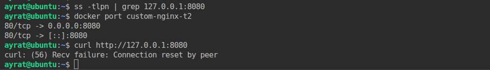  

 Как видим по скрину сервер nginx стал недоступен, так как мы поменяли порт nginx для "прослушивания". А в контейнере настройки не изменились.

12. Удалил запущенный контейнер "custom-nginx-t2", не останавливая его командой ```docker rm -f custom-nginx-t2```.  
  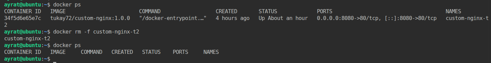  


## Задача 4


- Запустите первый контейнер из образа ***centos*** c любым тегом в фоновом режиме, подключив папку  текущий рабочий каталог ```$(pwd)``` на хостовой машине в ```/data``` контейнера, используя ключ -v.
- Запустите второй контейнер из образа ***debian*** в фоновом режиме, подключив текущий рабочий каталог ```$(pwd)``` в ```/data``` контейнера. 
- Подключитесь к первому контейнеру с помощью ```docker exec``` и создайте текстовый файл любого содержания в ```/data```.
- Добавьте ещё один файл в текущий каталог ```$(pwd)``` на хостовой машине.
- Подключитесь во второй контейнер и отобразите листинг и содержание файлов в ```/data``` контейнера.


В качестве ответа приложите скриншоты консоли, где видно все введенные команды и их вывод.

**Выполнение:**  
- Запустил первый контейнер из образа ***centos*** c тегом centos8 в фоновом режиме, подключил папку  текущий рабочий каталог ```$(pwd)``` на хостовой машине в ```/data``` контейнера, используя ключ -v.  
```
docker run -d -it --name centos -v $(pwd):/data centos:centos8
```
  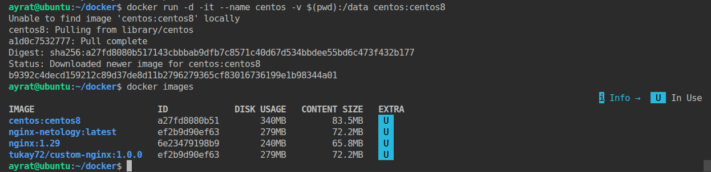  

- Запустил второй контейнер из образа ***debian*** в фоновом режиме, подключив текущий рабочий каталог ```$(pwd)``` в ```/data``` контейнера.  
```
docker run -d -it --name debian -v $(pwd):/data debian:stable-slim
```
  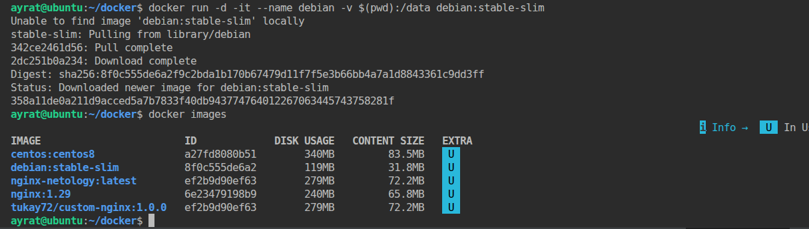  

- Подключился к первому контейнеру с помощью ```docker exec``` и создал текстовый файл centos_test.txt в ```/data```.
```
docker exec -it centos bash
```
  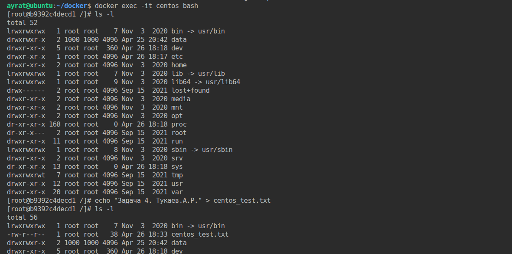  

- Добавил ещё один текстовой файл host.txt в текущий каталог ```$(pwd)``` на хостовой машине.  
  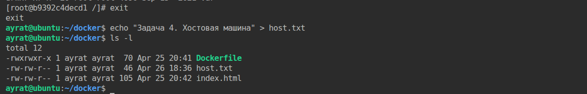  

  Тут я понял что создал файл не в той директорий в первом контейнере. Исправил.
  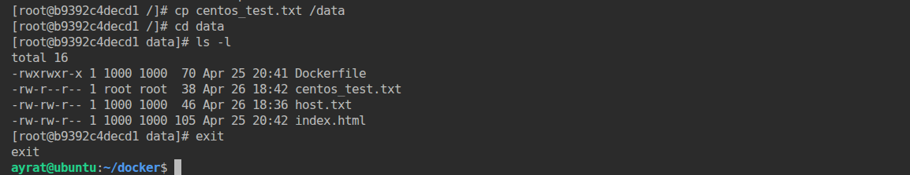  

- Подключился во второй контейнер и отобразил листинг и содержание файлов в ```/data``` контейнера. Все файлы созданные в первом контейнере и хосте, также которые имелись нахосте доступны во втором контейнере.
  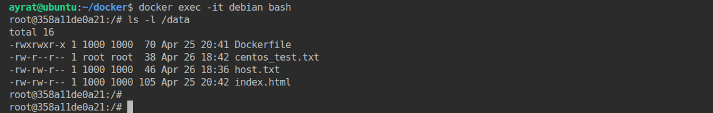  


## Задача 5

1. Создайте отдельную директорию(например /tmp/netology/docker/task5) и 2 файла внутри него.
"compose.yaml" с содержимым:
```
version: "3"
services:
  portainer:
    network_mode: host
    image: portainer/portainer-ce:latest
    volumes:
      - /var/run/docker.sock:/var/run/docker.sock
```
"docker-compose.yaml" с содержимым:
```
version: "3"
services:
  registry:
    image: registry:2

    ports:
    - "5000:5000"
```

И выполните команду "docker compose up -d". Какой из файлов был запущен и почему? (подсказка: https://docs.docker.com/compose/compose-application-model/#the-compose-file )

2. Отредактируйте файл compose.yaml так, чтобы были запущенны оба файла. (подсказка: https://docs.docker.com/compose/compose-file/14-include/)

3. Выполните в консоли вашей хостовой ОС необходимые команды чтобы залить образ custom-nginx как custom-nginx:latest в запущенное вами, локальное registry. Дополнительная документация: https://distribution.github.io/distribution/about/deploying/
4. Откройте страницу "https://127.0.0.1:9000" и произведите начальную настройку portainer.(логин и пароль адмнистратора)
5. Откройте страницу "http://127.0.0.1:9000/#!/home", выберите ваше local  окружение. Перейдите на вкладку "stacks" и в "web editor" задеплойте следующий компоуз:

```
version: '3'

services:
  nginx:
    image: 127.0.0.1:5000/custom-nginx
    ports:
      - "9090:80"
```
6. Перейдите на страницу "http://127.0.0.1:9000/#!/2/docker/containers", выберите контейнер с nginx и нажмите на кнопку "inspect". В представлении <> Tree разверните поле "Config" и сделайте скриншот от поля "AppArmorProfile" до "Driver".

7. Удалите любой из манифестов компоуза(например compose.yaml).  Выполните команду "docker compose up -d". Прочитайте warning, объясните суть предупреждения и выполните предложенное действие. Погасите compose-проект ОДНОЙ(обязательно!!) командой.

В качестве ответа приложите скриншоты консоли, где видно все введенные команды и их вывод, файл compose.yaml , скриншот portainer c задеплоенным компоузом.


---

### Правила приема

Домашнее задание выполните в файле readme.md в GitHub-репозитории. В личном кабинете отправьте на проверку ссылку на .md-файл в вашем репозитории.


