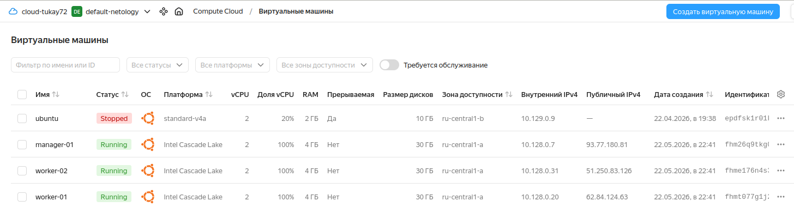
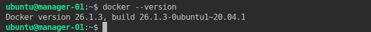
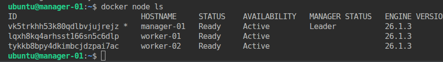

# Домашнее задание к занятию 6. «Оркестрация кластером Docker контейнеров на примере Docker Swarm» Тукаев Айрат

#### Это задание для самостоятельной отработки навыков и не предполагает обратной связи от преподавателя. Его выполнение не влияет на завершение модуля. Но мы рекомендуем его выполнить, чтобы закрепить полученные знания. Все вопросы, возникающие в процессе выполнения заданий, пишите в раздел "Вопросы по заданиям" в личном кабинете.

---

## Важно

**Перед началом работы над заданием изучите [Инструкцию по экономии облачных ресурсов](https://github.com/netology-code/devops-materials/blob/master/cloudwork.MD).**
Перед отправкой работы на проверку удаляйте неиспользуемые ресурсы.
Это нужно, чтобы не расходовать средства, полученные в результате использования промокода.
Подробные рекомендации [здесь](https://github.com/netology-code/virt-homeworks/blob/virt-11/r/README.md).

[Ссылки для установки открытого ПО](https://github.com/netology-code/devops-materials/blob/master/README.md).

---

## Задача 1

Создайте ваш первый Docker Swarm-кластер в Яндекс Облаке.
Документация swarm: https://docs.docker.com/engine/reference/commandline/swarm_init/
1. Создайте 3 облачные виртуальные машины в одной сети.
2. Установите docker на каждую ВМ.
3. Создайте swarm-кластер из 1 мастера и 2-х рабочих нод.

4. Проверьте список нод командой:
```
docker node ls
```
**Выполнение:**  
1. С помощью terraform создал 3 облачные виртуальные машины в одной сети.  
   

2. С помощью ansible установил docker на каждую ВМ.  
```
ansible-playbook -i inventory/hosts --private-key ~/.ssh/id_ed25519.pub playbook.yml
```
  

3. Создал swarm-кластер из 1 мастера и 2-х рабочих нод.  
```
docker swarm init --advertise-addr 10.128.0.7
docker swarm join-token worker
docker swarm join --token SWMTKN-1-52na4atcwnrbryvnr89swds9hzhxbepccujkpoefp033kvjs98-ca0uqv1fafcjnfejx52g3ftkt 10.128.0.7:2377
```

4. Проверил список нод командой:
```
docker node ls
```
  

## Задача 2 (*) (необязательное задание *).
1.  Задеплойте ваш python-fork из предыдущего ДЗ(05-virt-04-docker-in-practice) в получившийся кластер.
2. Удалите стенд.


## Задача 3 (*)

Если вы уже знакомы с terraform и ansible  - повторите практику по примеру лекции "Развертывание стека микросервисов в Docker Swarm кластере". Попробуйте улучшить пайплайн, запустив ansible через terraform с динамическим инвентарем.

Проверьте доступность grafana.

Иначе вернитесь к выполнению задания после прохождения модулей "terraform" и "ansible".

